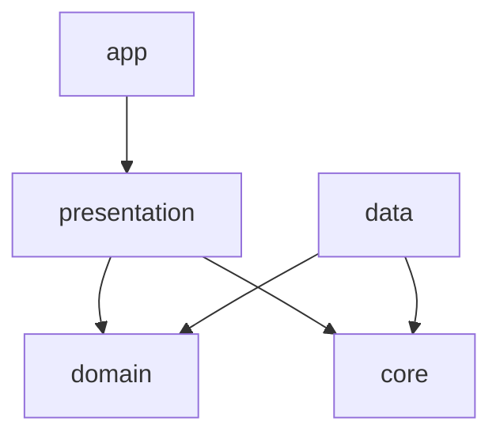

# MindDrop

An intelligent notes & tasks app for Android, built with on-device ML and a fully modularized Clean Architecture.

> [Add 1–2 sentences describing what MindDrop actually does for the user — e.g. what problem it solves and what the on-device model helps with.]

## About This Project

MindDrop started as a deliberate deep-dive into modern Android architecture. Every line of this codebase was written and reasoned through by hand — a way to genuinely internalize Clean Architecture, on-device ML integration, and modular app design, rather than just read about them.

## Features

- [Core note/task feature — e.g. quick capture, editing, organizing, reminders]
- **On-device intelligence**: [describe exactly what the TFLite model does — e.g. auto-categorization, priority detection, smart tagging]
- Offline-first, with background sync handled by WorkManager
- Efficient, paginated list loading (Paging 3)
- Local persistence via Room
- User preferences via DataStore

> Replace the bracketed items above with what the app actually does before publishing this — accuracy matters more than making it sound impressive.

## Architecture

MindDrop follows Clean Architecture across 5 modules: [confirm/replace with your actual module names — e.g. `app`, `presentation`, `domain`, `data`, `core`]



- **Presentation** — Jetpack Compose UI, ViewModels, UI state
- **Domain** — use cases and business rules, framework-independent
- **Data** — Room, DataStore, repositories, TFLite model access
- **Core** — shared utilities and base classes
- **App** — Hilt DI wiring and app entry point

> Adjust the layer names and diagram above to match your actual module boundaries.

## Tech Stack

| Layer | Tools |
|---|---|
| UI | Jetpack Compose |
| DI | Hilt |
| Persistence | Room, DataStore |
| Background work | WorkManager |
| Lists | Paging 3 |
| On-device ML | TensorFlow Lite |
| Language | Kotlin |
| Testing | [confirm your testing libraries — JUnit, Turbine, MockK, etc.] |

## Key Technical Decisions

### On-device ML vs. a cloud API
[Why TFLite over a hosted model — offline capability, latency, privacy, no per-inference cost. Include real numbers if you measured model size or inference time.]

### Offline-first & sync
[How WorkManager handles sync, and how conflicts are resolved if the same note is edited while offline.]

### Why 5 modules
[The boundaries you drew and why — build time, testability, ownership — and what a single-module app would have made harder.]

> This section is worth spending the most time on. It's what turns this from "a notes app" into a system-design conversation in an interview.

## Testing

[Describe your test coverage approach — which layers are unit tested, what's covered, roughly how many tests.]

## Getting Started

```bash
git clone https://github.com/<your-username>/minddrop.git
cd minddrop
```

Open in Android Studio (Giraffe or later), let Gradle sync, then run on a device or emulator with API [your minSdk]+.

## Screenshots

[Add 2–4 screenshots or a short demo GIF here — often the first thing a recruiter actually looks at.]

## License

[MIT / Apache 2.0 / or leave unlicensed — your call]
