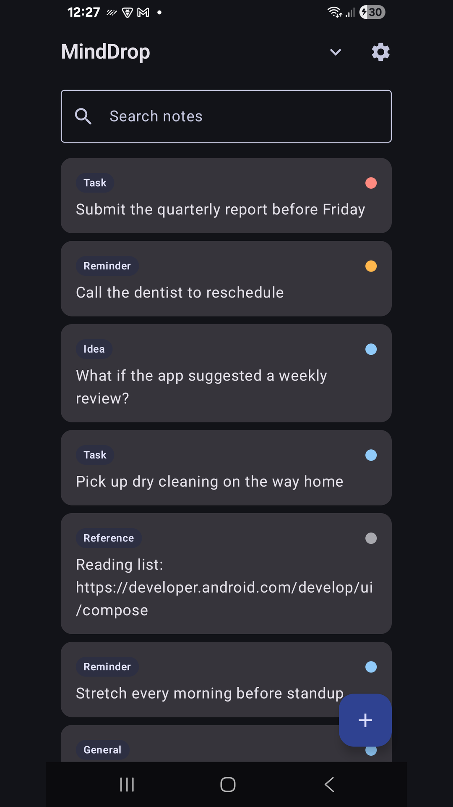
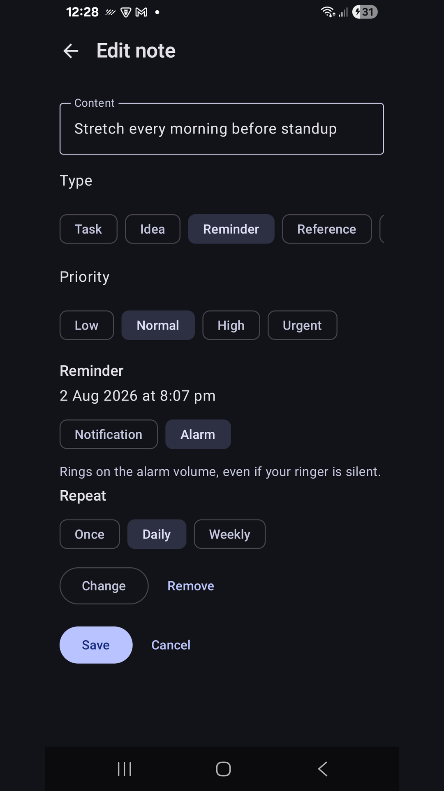
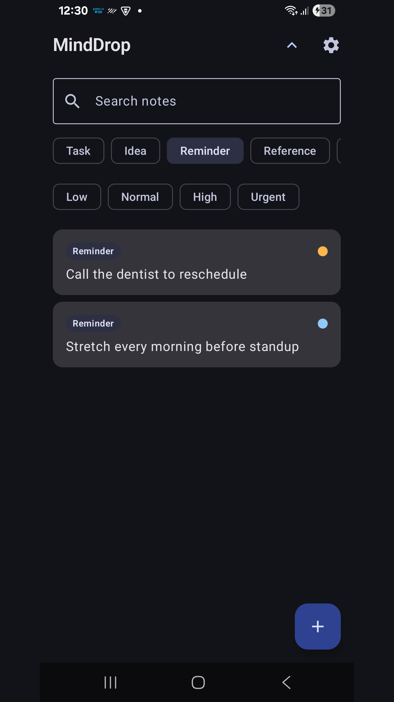
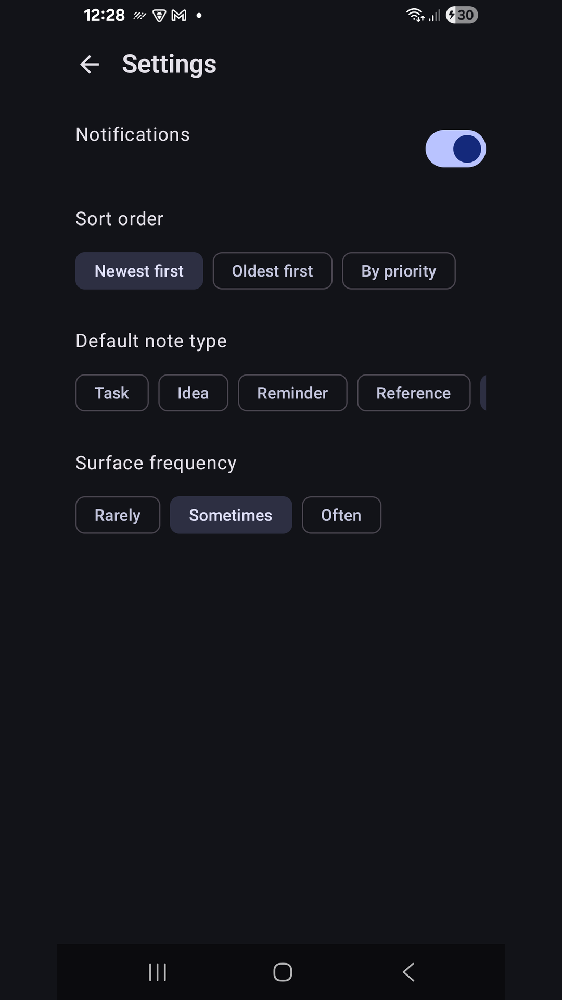
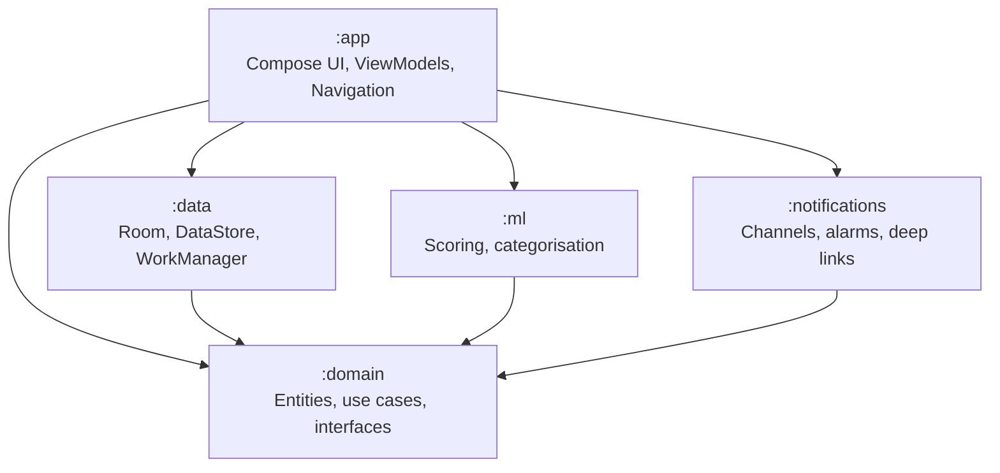

# MindDrop

An offline-first notes and tasks app for Android that decides when to show a note
back to you, built as a five-module Clean Architecture project in Kotlin and
Jetpack Compose.

Most notes apps are write-only: you capture something, it sinks down the list,
and you never see it again. MindDrop scores each note on urgency wording,
staleness and how often you open it, then resurfaces the ones worth your
attention. Notes can also carry a user-set reminder that arrives as a
notification, or as an alarm that rings on the alarm stream even when the phone
is silenced.

## Screenshots

| Notes | Reminders | Search & filter | Settings |
|---|---|---|---|
|  |  |  |  |

## Features

- **Quick capture** — open, type, save. Type and priority are optional.
- **Automatic categorisation** — content is classified as task, idea, reminder,
  reference or general from keyword signals. An explicit choice always wins.
- **Reminders and alarms** — pick a date and time per note, delivered as a
  notification or as an alarm on the alarm audio stream. Optional daily or
  weekly repeat. Tapping the notification deep-links to the note.
- **Intelligent resurfacing** — a periodic background pass scores every note on
  urgency keywords, staleness since last view, view frequency, freshness and
  note type, then surfaces those above a threshold.
- **Search and filtering** — debounced search plus type and priority filters,
  all resolved in SQL so they compose with pagination.
- **Offline-first** — Room is the single source of truth. No server, no account,
  no network permission.
- Material 3 theming with a full dark theme, swipe-to-delete, and Paging 3.

## Architecture

Five Gradle modules. Dependencies point inward: `:domain` is pure Kotlin and
depends on nothing in the project.


```mermaid
graph TD
    app[":app<br/>Compose UI, ViewModels, Navigation"] --> domain[":domain<br/>Entities, use cases, interfaces"]
    app --> data[":data<br/>Room, DataStore, WorkManager"]
    app --> ml[":ml<br/>Scoring, categorisation"]
    app --> notifications[":notifications<br/>Channels, alarms, deep links"]
    data --> domain
    ml --> domain
    notifications --> domain
```

`:domain` owns the contracts (`NoteRepository`, `SurfaceScorer`,
`NoteCategorizer`, `NoteSurfacer`, `ReminderScheduler`) and the feature modules
implement them, so the intelligence and delivery layers can be replaced without
the domain changing. Hilt binds implementations to contracts at the app level.

## Tech stack

| Concern | Choice |
|---|---|
| Language / UI | Kotlin, Jetpack Compose, Material 3 |
| Architecture | Clean Architecture, 5 modules, use cases between ViewModel and repository |
| DI | Hilt (`2.60.1`) |
| Persistence | Room (`2.8.4`) with migrations, DataStore Preferences |
| Pagination | Paging 3 (`3.5.0`) |
| Background work | WorkManager (`2.11.2`), AlarmManager for exact reminders |
| Navigation | Navigation Compose with type-safe routes (kotlinx.serialization) |
| Async | Coroutines, Flow, StateFlow |
| Testing | JUnit, Turbine, kotlinx-coroutines-test, paging-testing |

Kotlin `2.2.10`, AGP `9.2.1`, `minSdk 24`, `targetSdk 36`.

## Key technical decisions

### AlarmManager for reminders, not WorkManager
WorkManager is used for the periodic scoring pass, where "roughly every six
hours" is fine. It is the wrong tool for a user-set reminder: its work is
inexact and batched, so "remind me at 7am" could arrive materially late.
Reminders use `AlarmManager.setAlarmClock`, which survives Doze and app standby
and surfaces in the system's next-alarm slot.

The app requests `SCHEDULE_EXACT_ALARM` rather than `USE_EXACT_ALARM`: the
latter is granted at install but Play restricts it to apps whose core purpose is
alarms or calendars. When the user revokes it the scheduler degrades to an
inexact window instead of failing silently, and the UI offers a route to grant it.

Exact alarms cannot be registered as repeating (`setRepeating` has been inexact
since API 19), so a repeating reminder re-arms itself one occurrence at a time
after each fire, and the next occurrence is persisted so a reboot can recover it.

### Scheduling lives in use cases, not ViewModels
`AddNoteUseCase`, `UpdateNoteUseCase` and `DeleteNoteUseCase` each call the
`ReminderScheduler` themselves. That makes it structurally impossible to save a
note and forget to arm its alarm, or delete a note and leave an orphan alarm
firing for something that no longer exists.

### Search, filter and sort resolved in SQL
Pushing all three into a single Room query keeps them compatible with Paging 3.
Filtering a `PagingData` client-side would mean loading the whole table into
memory to narrow it, undoing pagination entirely. Sort order is parameterised
via `CASE` expressions rather than split across near-identical queries, so the
`WHERE` clause exists in exactly one place.

### Real migrations, never destructive fallback
The reminder feature added columns across two schema versions. Both ship as real
`Migration` objects and are covered by instrumented tests, because devices
already hold user notes — falling back to a destructive migration to add a
feature would be a data-loss bug.

### Dispatchers are injected
Hardcoded `Dispatchers.IO` inside `viewModelScope.launch` cannot be controlled by
a test scheduler, which makes state-transition assertions depend on real thread
timing. An `@IoDispatcher` / `@DefaultDispatcher` qualifier pair is injected
instead; the qualifiers live in `:domain` as plain `javax.inject` annotations so
the module stays free of any DI framework, while the bindings live in `:data`.
CPU-bound scoring runs on `Default`, disk work on `IO`.

### Compose stability without a Compose dependency in :domain
`Note` exposes `List<String>`, which the Compose compiler infers as unstable,
preventing `NoteCard` from skipping recomposition. Rather than annotate the
model — which would drag Compose into a pure Kotlin module — the domain models
are declared stable through a `compose_compiler_config.conf` stability file.

### On-device categorisation is keyword-based today
`:ml` has TensorFlow Lite wired in and a `TfLiteNoteCategorizer` that owns the
real integration points (asset loading, tensor I/O), but **no trained model
ships with the app**. Training a genuine five-class text classifier needs a
labelled dataset and a training pipeline that were out of scope, and shipping an
unvetted downloaded model was not a responsible alternative. The composite
categoriser falls back to a unit-tested keyword classifier, which does all the
real work. The TFLite path is therefore integration scaffolding and a
demonstration of the graceful-degradation pattern — not a working ML feature,
and the app is not marketed as one.

## Testing

64 JVM unit tests and 21 instrumented tests.

- **Scoring** — every factor isolated (urgency keywords including `by [day]` and
  `before [event]`, staleness tiers, view frequency, freshness, type weight) plus
  the 0–100 clamp.
- **ViewModels** — `Loading → Success` and `Loading → Error` transitions via
  Turbine, against hand-written fakes rather than mocks.
- **Reminders** — scheduling invariants (saving arms, clearing cancels, deleting
  cancels, editing replaces rather than stacks) and recurrence, including a daily
  reminder catching up correctly after the device was off for days.
- **Repository and DAO** — run against a real in-memory Room database, so the
  entity/domain mapper, type converters and SQL are all covered. A fake would
  only re-test a Kotlin reimplementation of the same rules.
- **Migrations** — instrumented tests drive each migration against a
  hand-built prior-version table and assert existing rows survive.

```bash
./gradlew test                      # JVM unit tests
./gradlew connectedAndroidTest      # instrumented, needs a device
```

## Getting started

```bash
git clone https://github.com/codecrafter9427/MindDrop.git
cd MindDrop
./gradlew :app:assembleDebug
```

Open in Android Studio, let Gradle sync, and run on a device or emulator with
API 24 or higher. No API keys or backend setup — the app is entirely local.

## Known limitations

Worth stating plainly rather than discovering in a review:

- **No tablet-specific layout.** The single-column list stretches to fill a wide
  screen. A two-pane list/detail layout at `sw600dp` is the natural fix.
- **No trained ML model**, as described above.
- **Strings are hardcoded**, so the app is not localisable as it stands.
- **Resurfacing notifications are lightly exercised.** The scoring and surfacing
  workers are unit-tested and verified running on-device, but a note crossing the
  surfacing threshold in normal use has not been observed end to end.

## License

Not yet licensed. Add one before reuse.
